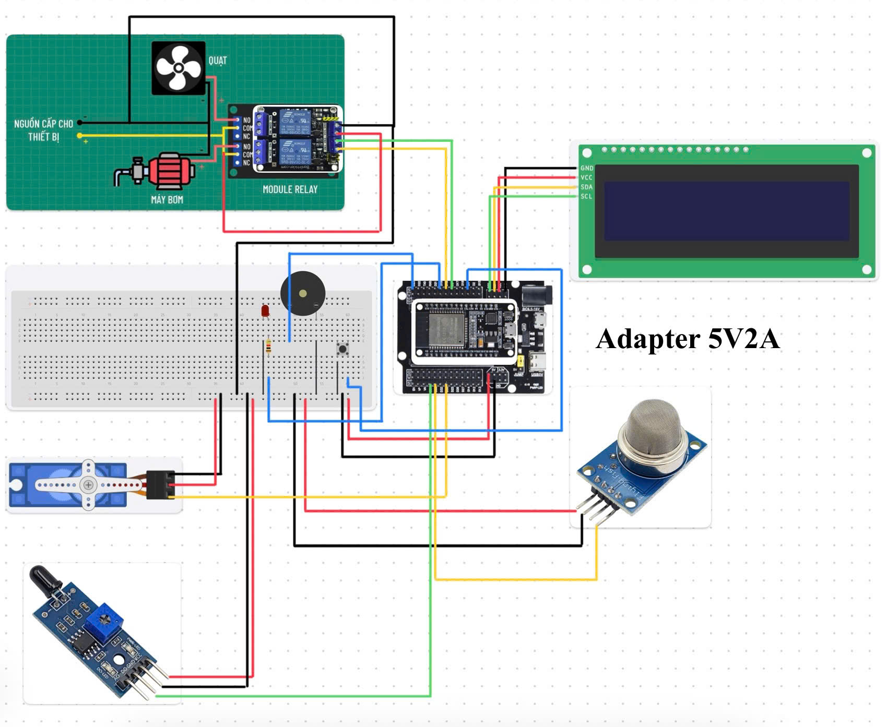
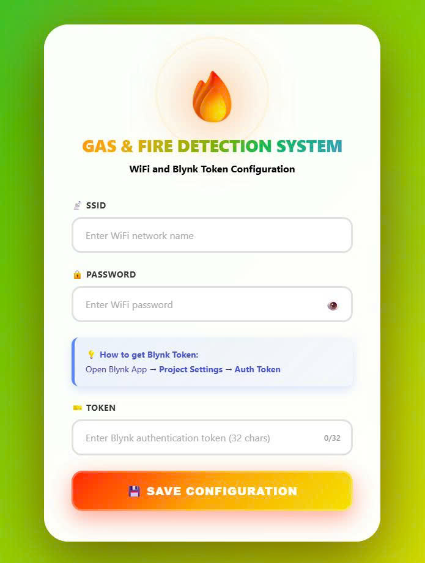
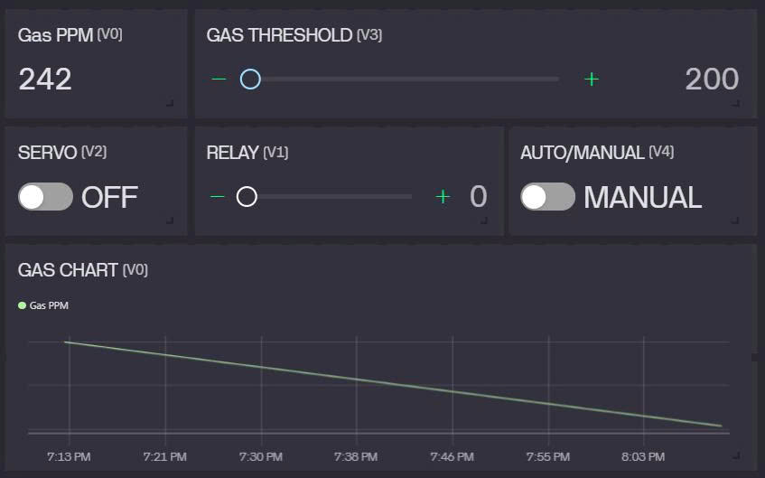

# 🔥 Gas & Fire Detection System

<div align="center">


**An intelligent IoT-based safety system for real-time gas leakage and fire detection with automated emergency response**

[Features](#-features) • [Hardware](#%EF%B8%8F-hardware-requirements) • [Installation](#-installation) • [Usage](#-usage) • [Configuration](#%EF%B8%8F-configuration)

</div>

---

## 📋 Description

This project implements a comprehensive safety monitoring system using ESP32 microcontroller that detects dangerous gas concentrations and fire hazards in real-time. The system automatically activates ventilation fans, water pumps, and emergency doors while sending instant notifications to your smartphone via Blynk IoT platform.

### Key Capabilities
- 🌡️ **Continuous Monitoring** - Real-time gas concentration tracking with Kalman filtering
- 🔔 **Instant Alerts** - Audio buzzer + LED indicators + push notifications
- 🤖 **Automated Response** - Smart activation of fans, pumps, and emergency exits
- 📱 **Remote Control** - Monitor and control via Blynk mobile app from anywhere
- 🌐 **Web Configuration** - Easy WiFi setup through captive portal
- 🧠 **Dual-Core Processing** - FreeRTOS task management for responsive operation

---

## 🛠️ Hardware Requirements

| Model | Quantity | Purpose |
|-----------|----------|---------|
| [ESP32](https://banlinhkien.com/kit-wifi-esp32-espwroom32s-p6649289.html) | 1 | Main processing unit with WiFi |
| [MQ-2](https://banlinhkien.com/module-cam-bien-khi-gas-mq2-p6646888.html) | 1 | Detects LPG, smoke, methane, CO |
| [Flame Sensor](https://banlinhkien.com/module-cam-bien-phat-hien-lua-flame-sensor-p6646877.html) | 1 | Infrared fire detection |
| [LCD 16x2 (I2C)](https://linhkienx.com/man-hinh-lcd-1602-nen-xanh-la-chu-den-5vdc-kem-i2c-driver) | 1 | Real-time status display |
| [Servo SG90](https://banlinhkien.com/dong-co-servo-sg90-goc-quay-180-p6648774.html) | 1 | Emergency door/window control |
| [Relay (2-channel)](https://banlinhkien.com/module-relay-mini-2-kenh-5v10a-blk-p17935548.html) | 1 | Fan & pump switching |
| [Buzzer](https://linhkienx.com/1209-buzzer-coi-chip-12x9mm-93db-xuyen-lo) | 1 | Audio warning system |
| [LED](https://linhkienx.com/led-do-3mm-sieu-sang-dau-tron-trong-suot-chan-dai) | 1 | Visual status indicator |
| [Button](https://linhkienx.com/nut-nhan-6x6mm-cao-4-3mm-4-chan-xuyen-lo) | 1 | Manual buzzer silence |

### Additional Components
- Jumper wires (Male-to-Male, Male-to-Female)
- Breadboard
- USB cable
- Enclosure box (recommended for safety)
- Adapter 5V2A

---

## 💻 Software Requirements

### Development Environment
- [PlatformIO IDE](https://platformio.org/) (VS Code extension)
- [Arduino Framework](https://www.arduino.cc/)

### Required Libraries
```ini
blynkkk/Blynk @ ^1.3.2
marcoschwartz/LiquidCrystal_I2C @ ^1.1.4
denyssene/SimpleKalmanFilter @ ^0.1.0
madhephaestus/ESP32Servo @ ^3.0.5
```

### Cloud Service
- [Blynk IoT Platform](https://blynk.io/) - Free account required

---

## ✨ Features

### 🎯 Core Functionality

#### Intelligent Detection System
- **Gas Monitoring**: MQ-2 sensor with Kalman filter for noise reduction
- **Fire Detection**: IR flame sensor with digital signal processing
- **Threshold Configuration**: Adjustable sensitivity (200-9999 PPM)
- **Hysteresis Control**: 100 PPM buffer to prevent oscillation

#### Automated Emergency Response

| Scenario | Fan | Water Pump | Door/Window | Buzzer | Notification |
|----------|-----|------------|-------------|--------|--------------|
| Gas Only | ✅ ON | ⭕ OFF | ✅ OPEN | 🔔 ON | "GAS DETECTED" |
| Fire Only | ⭕ OFF | ✅ ON | ✅ OPEN | 🔔 ON | "FIRE DETECTED" |
| Gas + Fire | ✅ ON | ✅ ON | ✅ OPEN | 🔔 ON | "EMERGENCY!" |
| Normal | ⭕ OFF | ⭕ OFF | ⭕ CLOSED | 🔇 OFF | - |

#### Operating Modes
- **AUTO Mode**: System responds automatically to threats
- **MANUAL Mode**: User controls via Blynk app/button
- **Smart Auto-Resume**: Returns to AUTO after 5s when all devices turn off

#### User Interface
- **LCD Display**: Shows gas PPM, relay states, servo status, mode
- **Smart Buzzer Silence**: Press button to mute alarm (safety first!)
- **Web Portal**: Beautiful configuration page with real-time validation
- **Mobile App**: Full control through Blynk dashboard

### 🌐 Connectivity

#### WiFi Configuration
1. **First Boot**: ESP32 creates "ESP32" access point
2. **Connect**: Join network and open `192.168.4.1`
3. **Configure**: Enter WiFi credentials + Blynk token
4. **Automatic**: System connects and operates

#### Blynk Integration
- **V0**: Gas concentration (PPM) - real-time graph
- **V1**: Relay control (0=Off, 1=Fan, 2=Pump, 3=Both)
- **V2**: Servo control (0=Close, 1=Open)
- **V3**: Threshold setting (200-9999 PPM slider)
- **V4**: AUTO/MANUAL mode switch

---

## 🔌 Wiring Diagram

### Pin Configuration

```
ESP32 GPIO Pinout Map
━━━━━━━━━━━━━━━━━━━━━━━━━━━━━━━━━━━━━━━━━━━━━━━

📥 INPUTS (Sensors & Controls)
├─ GPIO 35 (ADC)    → MQ-2 Gas Sensor (Analog Out)
├─ GPIO 34 (ADC)    → Flame Sensor (Digital Out)
└─ GPIO 4 (INPUT)   → Push Button (Active LOW)

📤 OUTPUTS (Actuators & Indicators)
├─ GPIO 18          → Relay Channel 1 (Fan)
├─ GPIO 5           → Relay Channel 2 (Water Pump)
├─ GPIO 33 (PWM)    → Servo Motor (Door/Window)
├─ GPIO 23          → Active Buzzer
└─ GPIO 19          → Status LED

🖥️ DISPLAY (I2C Protocol)
├─ GPIO 21 (SDA)    → LCD 16x2 Data Line
└─ GPIO 22 (SCL)    → LCD 16x2 Clock Line

⚡ POWER
├─ 5V               → VCC for all peripherals
└─ GND              → Common ground for all components
```

### Visual Diagram



> ⚠️ **Safety Warning**: High voltage connections (220V AC) must be handled by qualified personnel. Ensure proper insulation and follow electrical safety codes.

---

## 📦 Installation

### 1️⃣ Hardware Assembly
1. Connect all components according to the wiring diagram
2. Double-check power connections (5V to VCC, GND to GND)
3. Secure components in enclosure with proper ventilation

### 2️⃣ Software Setup

#### Install PlatformIO
```bash
# Install VS Code
https://code.visualstudio.com/

# Install PlatformIO extension
code --install-extension platformio.platformio-ide
```

#### Clone & Build
```bash
# Clone repository
git clone https://github.com/coldbrewtonic22/gas-fire-detection.git
cd gas-fire-detection

# Open in VS Code
code .

# Build project (PlatformIO will auto-download libraries)
pio run

# Upload to ESP32
pio run --target upload

# Monitor serial output
pio device monitor -b 115200
```

### 3️⃣ Blynk Configuration

#### Create Blynk Template
1. Go to [Blynk Console](https://blynk.cloud/)
2. Create new template: **"Gas and Fire Detection"**
3. Add datastreams:

| Virtual Pin | Name | Type | Range | Default |
|-------------|------|------|-------|---------|
| V0 | Gas PPM | Integer | 0-10000 | 0 |
| V1 | Relay Control | Integer | 0-3 | 0 |
| V2 | Door Control | Integer | 0-1 | 0 |
| V3 | Threshold | Integer | 200-9999 | 2200 |
| V4 | Mode | Integer | 0-1 | 1 |

4. Configure notification event: `gas_fire_detection`
5. Copy **Auth Token** (32 characters)

#### Dashboard Widgets
- **Gauge**: V0 (Gas PPM)
- **Slider**: V1 (Relay: 0-3)
- **Switch**: V2 (Door: 0/1)
- **Slider**: V3 (Threshold: 200-9999)
- **Switch**: V4 (AUTO=1, MANUAL=0)

---

## 🚀 Usage

### First-Time Setup

1. **Power On**: System displays startup sequence
   ```
   Gas and Fire
   Detection System
   
   Warming Up
   Sensors...
   
   Wait: 60 (s)
   ```

2. **WiFi Configuration**:
   - LCD shows: `Connect ESP32` / `192.168.4.1`
   - Connect phone/laptop to `ESP32` WiFi (open network)
   - Browser opens automatically (or navigate to `192.168.4.1`)
   - Enter WiFi SSID, Password, and Blynk Token
   - Click **SAVE CONFIGURATION**

3. **System Ready**:
   ```
   WiFi Connected
   [Your Network]
   
   Blynk Connected
   
   System's Ready
   ```

### Daily Operation

#### LCD Display Format
```
GAS:2100PPM AUTO    ← Line 1: Gas reading + Mode
RL:0 SRV:CLOSE      ← Line 2: Relay state + Servo status
```

#### Status Codes
- **RL:0** = All off | **RL:1** = Fan only
- **RL:2** = Pump only | **RL:3** = Both on
- **AUTO** = Automatic mode | **MNL** = Manual mode

#### Button Functions
| Action | Result |
|--------|--------|
| **Press** during alarm | Silences buzzer (devices remain active) |
| System recovers | Buzzer re-enables automatically |

#### Alert Sequence
```
┌─────────────────────────────────────────┐
│  Threat Detected                        │
├─────────────────────────────────────────┤
│  1. LED turns ON (red)                  │
│  2. Buzzer sounds (1s ON / 0.1s OFF)    │
│  3. LCD shows "WARNING" message         │
│  4. Devices activate per scenario       │
│  5. Blynk notification sent             │
│  6. Continues until threat clears       │
└─────────────────────────────────────────┘
```

### Mobile App Control

#### AUTO Mode (Recommended)
- System responds automatically
- Override possible via app
- Returns to AUTO after 5s of inactivity

#### MANUAL Mode
- Full control via Blynk app
- Set relay states individually
- Open/close door manually
- Adjust threshold in real-time

---

## ⚙️ Configuration

### Threshold Calibration

#### Via Blynk App
1. Set mode to **MANUAL**
2. Observe normal gas readings (V0)
3. Set threshold ~100 PPM above normal
4. Test with controlled gas exposure
5. Adjust until reliable

#### Via Code (`def.h`)
```cpp
#define GAS_THRESHOLD 2200  // Default value in PPM
```

### Hysteresis Adjustment
Modify `main.cpp` to change turn-off threshold:
```cpp
int HYSTERESIS = 100;  // Gas must drop 100 PPM below threshold
```

### Buzzer Pattern
Customize in `buzzerWarning()` function:
```cpp
void buzzerWarning()
{
    digitalWrite(BUZZER, BUZZER_ON);    delay(1000);  // ON duration
    digitalWrite(BUZZER, BUZZER_OFF);   delay(100);   // OFF duration
}
```

### Startup Delay
Change sensor warm-up time (currently 60 seconds):
```cpp
if (elapsed < 60)  // Change 60 to desired seconds
```

---

## 🏗️ System Architecture

```
               [ INPUTS ]                               [ ESP32 (CENTRAL PROCESSING UNIT) ]                         [ OUTPUTS ]
     ┌─────────────────────────────┐               ┌────────────────────────────────────────────┐               ┌───────────────────────────┐
     │ Sensors:                    │               │ [Core 0: Communication Tasks]              │               │ Actuators:                │
     │  • Gas Sensor (MQ-2)        ├──────────────►│  • TaskWebServer (AP broadcast, config)    │──────────────►│  • Relay (Fan)            │
     │  • Flame Sensor (IR)        ├──────────────►│  • TaskBlynk (Send/receive from Cloud)     │──────────────►│  • Relay (Water Pump)     │
     │                             │               │                                            │──────────────►│  • Servo (Door)           │
     │ User Interface:             │               │ [Core 1: Real-Time Logic Tasks]            │               │                           │
     │  • Button (Smart Silence)   ├──────────────►│  • TaskMainDisplay (Read/Filter/Decision)  │               │ Alerts:                   │
     │                             │               │  • TaskButton (Handle button, debounce)    │──────────────►│  • Buzzer (Audio Alert)   │
     └─────────────────────────────┘               │  • TaskBuzzer (Generate beep, non-blocking)│──────────────►│  • LED (Status Indicator) │
                                                   │                                            │               │                           │
                                                   │ I2C Protocol:                              │◄─────────────►│ Display:                  │
                                                   │  • (SDA / SCL)                             │               │  • LCD 16x2               │
                                                   └─────────────────────┬──────────────────────┘               └───────────────────────────┘
                                                             (Integrated WiFi Module)
                                                                         │
                                                                         │
                                                                         ▼         
                                                       ┌─────────────────┴───────────────────────────┐
                                                       │           NETWORK & CLOUD                   │
                                                       ├─────────────────────────────────────────────┤
                                                       │ [WiFi Router] -> [Internet] -> [Blynk Cloud]│
                                                       └─────────────────────────────────────────────┘
                                                                         │
                                                                         ▼
                                                                  [ User's Phone ]
                                                             (App Blynk / Web Browser)
                                                            
```

### Task Priority & Scheduling
| Task | Core | Priority | Stack | Update Rate |
|------|------|----------|-------|-------------|
| TaskWebServer | 0 | 5 | 8192 Bytes | 10ms |
| TaskBlynk | 0 | 5 | 8192 Bytes | 100ms |
| TaskMainDisplay | 1 | 5 | 4096 Bytes | 2000ms |
| TaskBuzzer | 1 | 5 | 2048 Bytes | 10ms |
| TaskButton | 1 | 5 | 2048 Bytes | 10ms |

---

## 🗂️ Project Structure

```
gas-fire-detection/
├── 📁 include
│   └── 📄 README
├── 📁 src
│   ├── ⚡ config.h
│   ├── ⚡ def.h
│   └── ⚡ main.cpp
├── 📝 README.md
├── 🖼️ blynk-dashboard.jpg
├── ⚙️ platformio.ini
├── 🖼️ web-portal.jpg
└── 🖼️ wiring-diagram.jpg
```

### File Descriptions

#### `src/main.cpp` (600+ lines)
Core application containing:
- FreeRTOS task definitions
- Sensor reading & filtering
- Emergency response logic
- Blynk callback handlers
- Web server & configuration portal
- LCD display management

#### `src/config.h`
Network configuration variables:
```cpp
#define APssid "ESP32"              // Access Point name
#define APpassword ""               // AP password (empty = open)

String EEPROMssid = "";             // Stored WiFi credentials
String EEPROMpassword = "";
String EEPROMblynkToken = "";
```

#### `src/def.h`
Hardware definitions & constants:
```cpp
// Pin assignments
#define MQ2_SENSOR 35
#define MH_SENSOR 34
#define BUZZER 23
// ... etc

// Blynk virtual pins
#define GAS_PIN V0
#define RELAY_PIN V1
// ... etc

// Default values
#define GAS_THRESHOLD 2200
```

#### `platformio.ini`
Build configuration:
```ini
[env:esp32dev]
platform = espressif32
board = esp32dev
framework = arduino
monitor_speed = 115200
lib_deps = 
    blynkkk/Blynk@^1.3.2
    marcoschwartz/LiquidCrystal_I2C@^1.1.4
    denyssene/SimpleKalmanFilter@^0.1.0
    madhephaestus/ESP32Servo@^3.0.5
```

---

## 🛠️ Technologies Used

### Embedded Systems
- **Wifi BLE SoC ESP32 ESP-WROOM-32**: ESP32-D0WDQ6 Dual-core low power Xtensa® 32-bit LX6 microprocessors
- **FreeRTOS**: Real-time operating system for task scheduling
- **Arduino Framework**: Simplified hardware abstraction layer

### Sensors & Signal Processing
- **MQ-2 Gas Sensor**: Analog semiconductor sensor (SnO2)
- **Kalman Filter**: Recursive noise reduction algorithm
- **Hysteresis Control**: Prevents oscillation in threshold detection

### Communication Protocols
- **I2C**: LCD display communication (21 -> SDA, 22 -> SCL)
- **PWM**: Servo motor control (50Hz pulse width modulation)
- **HTTP**: Web server for configuration portal
- **WebSocket**: Blynk real-time data streaming

### IoT Platform
- **Blynk**: Cloud-based IoT dashboard with push notifications
- **EEPROM**: Non-volatile configuration storage
- **mDNS**: Network service discovery (future enhancement)

### Web Technologies
- **HTML5**: Responsive configuration interface
- **CSS3**: Gradient animations & glassmorphism design
- **JavaScript**: Form validation & dynamic UI updates

### Development Tools
- **PlatformIO**: Cross-platform build system & IDE
- **Git**: Version control system
- **VS Code**: Source code editor

---

## 🔧 Troubleshooting

<details>
<summary>❌ WiFi Connection Failed</summary>

**Symptoms**: LCD shows "Disconnect WiFi" repeatedly

**Solutions**:
1. Verify SSID and password (case-sensitive)
2. Check if router uses 2.4GHz (ESP32 doesn't support 5GHz)
3. Ensure router isn't in MAC address filtering mode
4. Try connecting to an open network first
5. Reset configuration: Hold button during power-on

</details>

<details>
<summary>❌ Blynk Connection Failed</summary>

**Symptoms**: "Disconnect Blynk" message despite WiFi working

**Solutions**:
1. Verify token is exactly 32 characters
2. Check template ID matches in code and Blynk console
3. Ensure device is online in Blynk console
4. Recreate template and generate new token
5. Check firewall isn't blocking port 80/443

</details>

<details>
<summary>❌ False Gas Alarms</summary>

**Symptoms**: Frequent alarms with no visible threat

**Solutions**:
1. Increase threshold via Blynk (start at 3000 PPM)
2. Let sensor warm up for full 60 seconds
3. Ensure sensor isn't near alcohol, perfume, or cleaning products
4. Check sensor placement (away from direct airflow)
5. Increase hysteresis value in code

</details>

<details>
<summary>❌ LCD Not Displaying</summary>

**Symptoms**: Backlight on but no text

**Solutions**:
1. Check I2C address (use I2C scanner: usually 0x27 or 0x3F)
2. Verify SDA/SCL connections (21/22)
3. Adjust contrast potentiometer on LCD backpack
4. Test with simple I2C example code
5. Try different I2C speed in code

</details>

<details>
<summary>❌ Servo Jittering</summary>

**Symptoms**: Servo vibrates or moves erratically

**Solutions**:
1. Use external 5V power supply (not USB)
2. Add 100µF capacitor across servo power
3. Ensure common ground between ESP32 and power supply
4. Check signal wire isn't near high-current paths
5. Reduce PWM frequency if needed

</details>

---

## 📸 Screenshots

<table>
<tr>
<td width="50%">

### 🌐 Web Configuration Portal


Beautiful responsive design with:
- Animated gradient background
- Real-time token character counter
- Form validation
- Mobile-friendly interface

</td>
<td width="50%">

### 📱 Blynk Mobile Dashboard


Control everything remotely:
- Live gas PPM gauge
- Relay & servo switches
- Threshold slider
- AUTO/MANUAL toggle

</td>
</tr>
<tr>
<td width="50%">

### 🖥️ LCD Display (Normal)
```
┌────────────────┐
│GAS:2100PPM AUTO│
│RL:0 SRV:CLOSE  │
└────────────────┘
```

</td>
<td width="50%">

### ⚠️ LCD Display (Alert)
```
┌────────────────┐
│    WARNING     │
│  GAS DETECTED  │
└────────────────┘
```

</td>
</tr>
</table>

---

## 🤝 Contributing

Contributions are welcome! Please follow these steps:

1. **Fork** the repository
2. **Create** a feature branch (`git checkout -b feature/AmazingFeature`)
3. **Commit** your changes (`git commit -m 'Add AmazingFeature'`)
4. **Push** to branch (`git push origin feature/AmazingFeature`)
5. **Open** a Pull Request

### Contribution Ideas
- [ ] Add SMS notifications via Twilio
- [ ] Implement data logging to SD card
- [ ] Create 3D-printed enclosure design
- [ ] Add temperature/humidity sensors (DHT22)
- [ ] Integrate with Home Assistant
- [ ] Multi-language support for web portal

---

## 📜 License

This project is licensed under the **MIT License** - see the [LICENSE](LICENSE) file for details.

```
MIT License

Copyright (c) 2024 Quan Vu

Permission is hereby granted, free of charge, to any person obtaining a copy
of this software and associated documentation files (the "Software"), to deal
in the Software without restriction, including without limitation the rights
to use, copy, modify, merge, publish, distribute, sublicense, and/or sell
copies of the Software, and to permit persons to whom the Software is
furnished to do so, subject to the following conditions:

The above copyright notice and this permission notice shall be included in all
copies or substantial portions of the Software.

THE SOFTWARE IS PROVIDED "AS IS", WITHOUT WARRANTY OF ANY KIND, EXPRESS OR
IMPLIED, INCLUDING BUT NOT LIMITED TO THE WARRANTIES OF MERCHANTABILITY,
FITNESS FOR A PARTICULAR PURPOSE AND NONINFRINGEMENT.
```

---

## 👤 Author

<div align="center">

**Quan Vu**

[](https://github.com/coldbrewtonic22)
[](mailto:vmquan.dev@gmail.com)

</div>

---

## ⭐ Acknowledgments

- **Blynk Team** - For the amazing IoT platform
- **PlatformIO** - For the excellent build system
- **Arduino Community** - For comprehensive libraries
- **ESP32 Community** - For technical documentation
- **MQ-2 Datasheet Authors** - For sensor specifications

---

## 📞 Support

If you encounter any issues or have questions:

1. 📖 Check the [Troubleshooting](#-troubleshooting) section
2. 🔍 Search existing [GitHub Issues](https://github.com/coldbrewtonic22/gas-fire-detection/issues)
3. 💬 Open a new issue with detailed description
4. 📧 Email: [vmquan.dev@gmail.com](mailto:vmquan.dev@gmail.com)

---

<div align="center">

### ⚠️ Safety Disclaimer

This system is designed as a **supplementary safety device** and should **NOT** replace professional fire detection systems or building safety codes. Always ensure compliance with local fire safety regulations. The author assumes no liability for damages or injuries resulting from the use of this device.

---

**If you found this project helpful, please consider giving it a ⭐!**

Made with ❤️ and ESP32

</div>